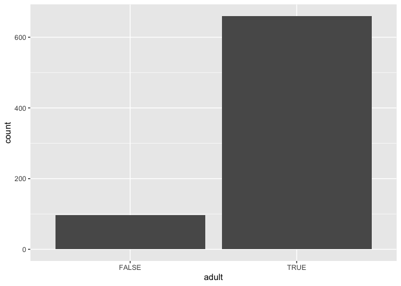
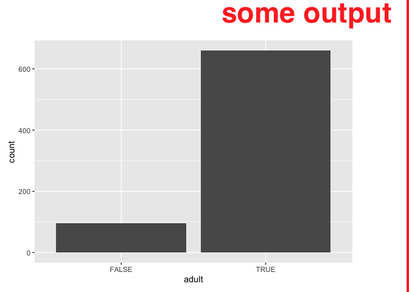
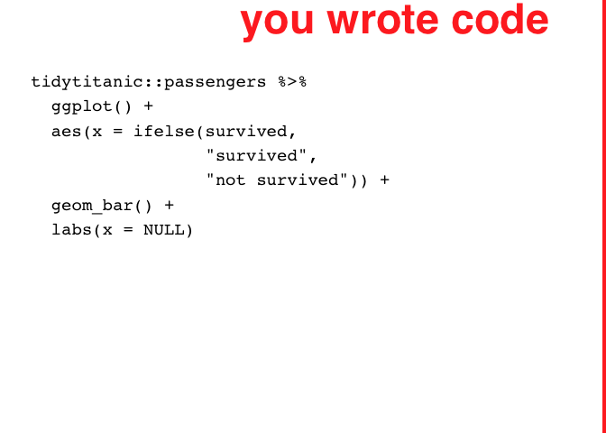
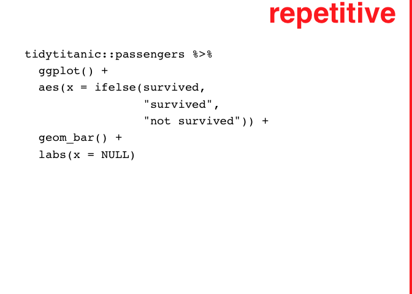

# ggjudge

Discussion about the successes and failures of data visualization can be
lengthy and nuanced. This is in contrast to the speed at which data
visualizations themselves communicate. Data visualization is powerful
because of ‘preattentive’ visual processing: patterns are perceived
almost instantaneously compared with raw data counterparts.

To facilitate in a ‘bottom-line-up-front’ discussion of data
visualization questions, analysts have used meta annotation of plots to
communicate their perspectives and overall assessments of plots’
success. Wilke 2018.

The goal of ggjudge is to easily allow for more meta annotation in the
ggplot2 framework. Using FDV (Wilke) strategy for expressing high level
judgments about plot’s effectiveness, also extending to code, and to
text console output. Uses cowplot’s ggdraw functions.

The code is based on code that was used in Wilke’s book.

Furthermore, given the visual creators are likely to return to code, the
same ‘final judge’ approach may be applied to code snippets to quickly
communicate overall assessments of coding strategies.

Therefore, ggjudge also makes functions available for code judgement;
the downside is that this code is imaged in a data visualization which
is not lightweight and does not allow for copy/paste. Finally, ggjudge
provides the ability to judge text outputs.

Current functions are:

  - judge\_plot
  - judge\_chunk\_code
  - judge\_chunk\_output\_plot
  - judge\_chunk\_output\_text

Later 3 assume use of .Rmds;

These is not very customizable presently, but follows pretty closely to
Wilk’s choices, which were very effective.

<!-- badges: start -->

<!-- badges: end -->

# Judge plot

``` r
#' Title
#'
#' @param plot 
#' @param color 
#' @param alpha 
#' @param judgement 
#' @param family 
#' @param fontface 
#' @param clip 
#' @param plot.margin 
#' @param x 
#' @param y 
#' @param vjust 
#' @param hjust 
#' @param size 
#' @param angle 
#'
#' @return
#' @export
#'
#' @examples
judge_plot <- function(
  plot = NULL, 
  color = "red", 
  alpha =.9, 
  judgement = "you made\na plot", 
  family = "Helvetica",
  fontface = "bold", 
  clip = "off", 
  plot.margin = margin(50, 70, 10, 10),
  x=1, y=1, vjust=1.1, hjust=1.1, size=35, angle = 0
  ){
  
  if(is.null(plot)){plot <- ggplot2::last_plot()}
  
  cowplot::ggdraw(plot + theme(plot.margin = plot.margin),
                  clip = clip) +
    cowplot::draw_text(paste0(judgement, ""), x=x, y=y, vjust=vjust, hjust=hjust, size=size, angle = angle,
              color=color, alpha=alpha, family = family, fontface = fontface) +
    
    cowplot::draw_line(c(1, 1), c(0, 1), size= 2.8, color=color, alpha=alpha)
}
```

``` r
library(tidyverse)
#> ── Attaching core tidyverse packages ──────────────────────── tidyverse 2.0.0 ──
#> ✔ dplyr     1.1.0     ✔ readr     2.1.4
#> ✔ forcats   1.0.0     ✔ stringr   1.5.0
#> ✔ ggplot2   3.4.1     ✔ tibble    3.2.0
#> ✔ lubridate 1.9.2     ✔ tidyr     1.3.0
#> ✔ purrr     1.0.1     
#> ── Conflicts ────────────────────────────────────────── tidyverse_conflicts() ──
#> ✖ dplyr::filter() masks stats::filter()
#> ✖ dplyr::lag()    masks stats::lag()
#> ℹ Use the conflicted package (<http://conflicted.r-lib.org/>) to force all conflicts to become errors

p <- tidytitanic::passengers %>% 
  mutate(adult = age >= 18 ) %>% 
  filter(!is.na(age)) %>% 
ggplot() + 
  aes(x = adult) + 
  geom_bar()

judge_plot(plot = p, judgement = "awkward")
```



# Judge chunk plot output

``` r
#' Title
#'
#' @param chunk_name 
#' @param judgement 
#'
#' @return
#' @export
#'
#' @examples
judge_chunk_output_plot <- function(chunk_name, judgement = "some output"){
    
  knitr::knit_code$get(name = chunk_name) |>  
  paste(collapse = "\n") ->
text
  
eval(parse(text = text)) -> p

p %>% judge_plot(family = "Helvetica", color = "red", alpha = .9, judgement = judgement, fontface = "bold")

}
```

``` r
# chunk name: survived_plot2
p <- tidytitanic::passengers %>% 
  mutate(adult = age >= 18 ) %>% 
  filter(!is.na(age)) %>% 
ggplot() + 
  aes(x = adult) + 
  geom_bar()
```

``` r
judge_chunk_output_plot(chunk_name = "survived_plot2")
```



# Judge code chunk code

``` r
#' Title
#'
#' @param chunk_name 
#' @param judgement 
#' @param ... 
#'
#' @return
#' @export
#'
#' @examples
judge_chunk_code <- function(chunk_name, judgement = "you wrote code", ...){
  
  knitr::knit_code$get(name = chunk_name) |>  
  paste(collapse = "\n") ->
code


# text <- "tidytitanic::passengers %>% \n  mutate(adult = age >=18 ) %>% \n  filter(!is.na(age)) %>% \nggplot() + \n  aes(x = adult) + \n  geom_bar()"

ggplot2::ggplot(data = data.frame(x = c(0, 1), y = c(0,1))) +
  ggplot2::aes(x = x, y = y) +
  ggplot2::geom_blank() +
  ggplot2::annotate("text", label = code, x = 0, y = 1, hjust = 0, vjust = 1, size = 5, family = "Courier") + 
  ggplot2::theme_void() ->
syntax_plot

syntax_plot %>% judge_plot(judgement = judgement, ...)
  
}
```

``` r
tidytitanic::passengers %>% 
  ggplot() + 
  aes(x = ifelse(survived, 
                 "survived",
                 "not survived")) + 
  geom_bar() + 
  labs(x = NULL)
```

``` r
judge_chunk_code("titanic_plot", judgement = "repetative")
```



# Judge chunk text output

``` r
#' Title
#'
#' @param chunk_name 
#' @param judgement 
#'
#' @return
#' @export
#'
#' @examples
judge_chunk_output_text <- function(chunk_name, judgement = "some output"){
    
  knitr::knit_code$get(name = chunk_name) |>  
  paste(collapse = "\n") ->
text
  
capture.output(eval(parse(text = text))) -> output

output %>% 
   paste(collapse = "\n") ->
output_clean


library(ggplot2)
ggplot(data = data.frame(x = c(0, 1), y = c(0,1))) +
  aes(x = x, y = y) +
  geom_blank() +
  annotate("text", label = output_clean, 
           x = 0, y = 1, hjust = 0, vjust = 1, 
           size = 5, family = "Courier") + 
  theme_void() ->
output_plot

output_plot %>% judge_plot(family = "Helvetica", color = "red", alpha = .9, judgement = judgement, fontface = "bold")

}
```

``` r
library(magrittr)
#> 
#> Attaching package: 'magrittr'
#> The following object is masked from 'package:purrr':
#> 
#>     set_names
#> The following object is masked from 'package:tidyr':
#> 
#>     extract
tidytitanic::passengers |> 
  janitor::tabyl(sex, survived)
#>     sex   0   1
#>  female 154 308
#>    male 709 142
```

``` r
judge_chunk_output_text(chunk_name = "titanic_table")
```



# send functions to package .R dir

``` r
chunk_send_to_dir_r <- function(chunk_name){
  
  for(i in 1:length(chunk_name)){

knitr::knit_code$get(name = chunk_name[i]) |>
    paste(collapse = "\n") |>
    writeLines(con = paste0("R/", chunk_name[i], ".R"))
    
  }
  
}


chunk_send_to_dir_r(chunk_name = c("judge_plot", "judge_chunk_code", "judge_chunk_output_plot", "judge_chunk_output_text"))
```

# send tests to tests

``` r
chunk_send_to_dir_tests_testthat <- function(chunk_name){
  
  for(i in 1:length(chunk_name)){

knitr::knit_code$get(name = chunk_name[i]) |>
    paste(collapse = "\n") |>
    writeLines(con = paste0("tests/testthat/", chunk_name[i], ".R"))
    
  }
  
}
```

``` r
testthat::test_that("multiplication works", {
  expect_equal(2 * 2, 4)
})
```

``` r
chunk_send_to_dir_tests_testthat("test_judge_chunk_code")
```

# maybe later ideas

``` r
library(patchwork)

judge_chunk_plot <- function


judge_chunk <- function(chunk_name, 
                        judgement_code = "code", 
                        judgement_output = "output", 
                        ...){
  
  
  judge_chunk_code(chunk_name = chunk_name, 
                   judgement = judgement_code) /
    judge_chunk_output(chunk_name = chunk_name, 
                       judgement = judgement_output)
  
  
}
```

``` r
judge_chunk(chunk_name = "table_chunk", 
            judgement_code = "code: using indicator variable directly",
            judgement_output = "output: information is lost")
```

<!-- This Rmd file contains all the code needed to define an R package.  Press "Knit" in RStudio or more generally run `litr::render("name-of-this-file.Rmd")` to generate the R package.  Remember that when you want to modify anything about the R package, you should modify this document rather than the package that is outputted.
-->
