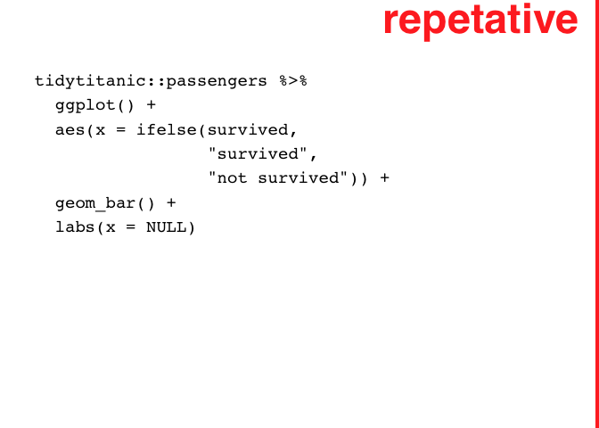

<!-- README.md is generated from README.Rmd. Please edit that file -->

# ggjudge

FDV (Wilke) strategy for expressing high level judgments about plot’s
effectiveness, also extended to code, and hopefully soon to text console
output. Uses cowplot’s ggdraw functions.

<!-- badges: start -->

<!-- badges: end -->

``` r

judge_plot <- function(p = NULL, color = "red", alpha =.9, label = "you made\na plot", 
                  family = "Helvetica",
                  fontface = "bold", clip = "on"){
  
  if(is.null(p)){p <- ggplot2::last_plot()}
  
  cowplot::ggdraw(p + theme(plot.margin = margin(50,150,10,10))
                  ,
                  clip = clip) +
    cowplot::draw_text(paste0(label, "  "), x=1, y=1, vjust=1.1, hjust=1.1, size=35, angle = 0,
              color=color, alpha=alpha, family = family, fontface = fontface) +
    cowplot::draw_line(c(1, 1), c(0, 1), size= 2.8, color=color, alpha=alpha)
}


library(tidyverse)
#> ── Attaching core tidyverse packages ──────────────────────── tidyverse 2.0.0 ──
#> ✔ dplyr     1.1.0     ✔ readr     2.1.4
#> ✔ forcats   1.0.0     ✔ stringr   1.5.0
#> ✔ ggplot2   3.4.1     ✔ tibble    3.2.0
#> ✔ lubridate 1.9.2     ✔ tidyr     1.3.0
#> ✔ purrr     1.0.1     
#> ── Conflicts ────────────────────────────────────────── tidyverse_conflicts() ──
#> ✖ dplyr::filter() masks stats::filter()
#> ✖ dplyr::lag()    masks stats::lag()
#> ℹ Use the conflicted package (<http://conflicted.r-lib.org/>) to force all conflicts to become errors


tidytitanic::passengers %>% 
  mutate(adult = age >= 18 ) %>% 
  filter(!is.na(age)) %>% 
ggplot() + 
  aes(x = adult) + 
  geom_bar()
```


``` r
  
judge_plot()
```


``` r
tidytitanic::passengers %>% 
  ggplot() + 
  aes(x = ifelse(survived, 
                 "survived",
                 "not survived")) + 
  geom_bar() + 
  labs(x = NULL)
```

``` r

judge_code_chunk <- function(chunk_name, label = "you wrote code", ...){
  
  knitr::knit_code$get(name = chunk_name) |>  
  paste(collapse = "\n") ->
text


# text <- "tidytitanic::passengers %>% \n  mutate(adult = age >=18 ) %>% \n  filter(!is.na(age)) %>% \nggplot() + \n  aes(x = adult) + \n  geom_bar()"

ggplot2::ggplot(data = data.frame(x = c(0, 1), y = c(0,1))) +
  ggplot2::aes(x = x, y = y) +
  ggplot2::geom_blank() +
  ggplot2::annotate("text", label = text, x = 0, y = 1, hjust = 0, vjust = 1, size = 5, family = "Courier") + 
  ggplot2::theme_void() ->
syntax_plot

syntax_plot %>% judge_plot(label = label, ...)
  
}

judge_code_chunk("test_chunk")
```



# need to run in interactive session…

``` r
library(magrittr)
#> 
#> Attaching package: 'magrittr'
#> The following object is masked from 'package:purrr':
#> 
#>     set_names
#> The following object is masked from 'package:tidyr':
#> 
#>     extract
tidytitanic::passengers |> 
  janitor::tabyl(sex, survived)
#>     sex   0   1
#>  female 154 308
#>    male 709 142
```

``` r
    knitr::knit_code$get(name = "test_chunk_2") |>  
  paste(collapse = "\n") ->
text


text
#> [1] "library(magrittr)\ntidytitanic::passengers |> \n  janitor::tabyl(sex, survived)"
eval(parse(text = text))
#>     sex   0   1
#>  female 154 308
#>    male 709 142

{
    knitr::knit_code$get(name = "test_chunk_2") |>  
  paste(collapse = "\n") ->
text
sink("temp.txt")
eval(parse(text = text))
sink()
}

# {
# sink('temp.txt')
# print(1:10)
# sink()
# }
```

``` r
readLines("temp.txt") %>% 
  paste(collapse = "\n") ->
  text

text
#> [1] ""

library(ggplot2)
ggplot(data = data.frame(x = c(0, 1), y = c(0,1))) +
  aes(x = x, y = y) +
  geom_blank() +
  annotate("text", label = text, x = 0, y = 1, hjust = 0, vjust = 1, size = 5, family = "Courier") + 
  theme_void() ->
output_plot

output_plot %>% judge_plot(family = "Helvetica", color = "red", alpha = .9, label = "awkward", fontface = "bold")
```


